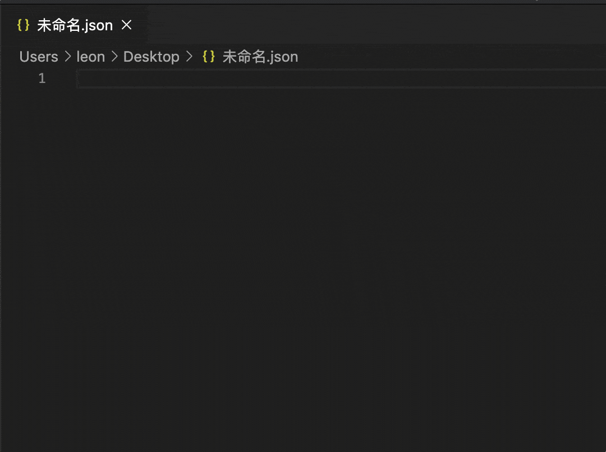

# Auto insert Comma

Automatically add JSON/JavaScript Object comma.

## Usages

Just `Enter` or `CMD(Ctrl) + Enter` in the file.



## Extension Settings

Default value.

```json
{
  "auto-insert-comma.enableAutoInsertComma": true
}
```

```json
{
  "auto-insert-comma.activationFiles": [
      "json",
      "html",
      "javascript",
      "typescript",
      "vue",
      "javascriptreact",
      "typescriptreact",
      "php",
      "ejs",
      "jinja",
      "plaintext",
      "markdown",
      "python"
     ]
}
```

```json
{
  "auto-insert-comma.disableFiles": []
}
```

**Enjoy!**
